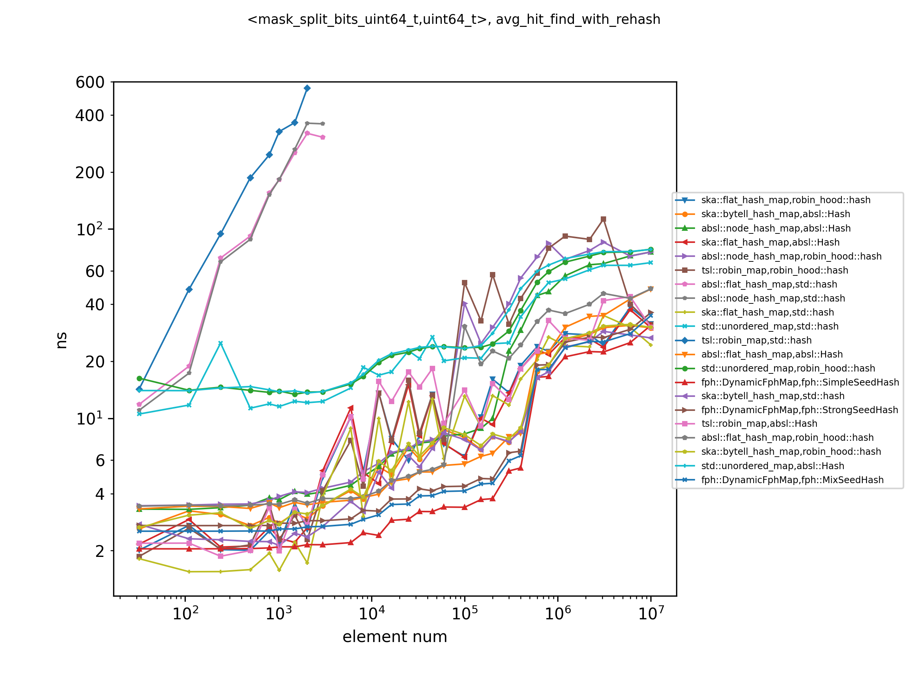
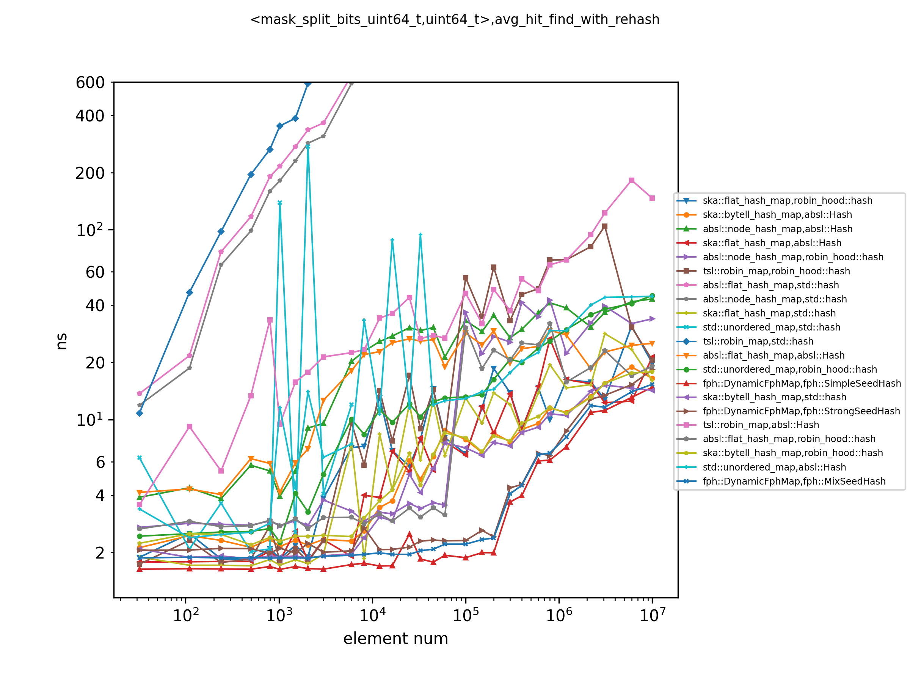

# Flash Perfect Hash

The Flash Perfect Hash (FPH) library is a modern C++ implementation of a dynamic [perfect hash](https://en.wikipedia.org/wiki/Perfect_hash_function)
table (no collisions for the hash), which makes the hash map/set extremely fast for lookup operations.

We provide four container classes `fph::DynamicFphSet`,`fph::DynamicFphMap`,`fph::MetaFphSet` and
`fph::MetaFphMap`. The APIs of these four classes are almost the same as those of
`std::unordered_set` and `std::unordered_map`, but there are some minor differences, which we will
explain in detail below. To compile this code, you need to use at least C++17 or newer standards.

Generally speaking, the containers here are suitable for the situation where the performance of the
lookup is very important, and the number of insertions is small compared to the query, or the keys are fixed.

## Performance

Here we show the timing of the `find`operation when a 64-bit integer is used as the key. The results are from the
[hashtable-bench](https://github.com/renzibei/hashtable-bench) project, which evaluates hash maps on different datasets.

Figures 1 and 2 show the lookup time of multiple hash tables using different hash functions on the x86-64 platform and
arm64 platform. It can be seen that `fph::DynamicFphMap` has a clear speed advantage in lookup on this dataset.

For a comparison of more datasets and more operation types, please refer to the [benchmark](https://github.com/renzibei/hashtable-bench).



<center>Figure 1: Look up keys in the map with 0.9 max_load_factor, tested in AMD 3990x</center>



<center>Figure 2: Look up keys in the map with 0.9 max_load_factor, tested in Apple M1 Max</center>

`fph::MetaFphMap` is faster than `fph::DynamicFphMap` with `find` operation when try to find the
keys that are not in the table and the elements number is large. `fph::MetaFphMap` uses a metadata
array to save the information including the position markers and part of the hash values. So when it
tries to find a key not in the table, we can probably use the metadata itself to know the fact that
this key does not exist, without fetching the main slots. This can save the cache space.
Correspondingly, when trying to find the keys in the table, or when the elements number is small,
`fph::DynamicFphMap` will be faster.


## Algorithm

The time for a hash table to find the key is determined by the cost of calculating the hash, the
number of times the data is read from the memory, and the cost of each memory access.

Almost every hash table dedicated to optimizing query performance will take some measures to reduce
the number of memory accesses. For example, Google's [absl hash table](https://abseil.io/blog/20180927-swisstables)
uses metadata and SIMD instruction to reduce the number of memory fetches; robin hood hashing is
aimed at reducing the variance of probe distances, which can make the lookup more cache-friendly.

Perfect hashing, by definition, minimizes the number of hashes and the number of memory accesses.
It only needs to fetch the memory once to get the required data from the slots. Of course, the fly
in the ointment is that the perfect hash function itself requires the parameter space that is
proportional to the number of keys. Fortunately, the extra space required by FPH is not worth mentioning
compared to the slots for storing data, and this space will not cause a significant increase in the cache miss rate.

The idea of FPH originates from the [FCH algorithm](https://dl.acm.org/doi/abs/10.1145/133160.133209),
which is a perfect hash algorithm suitable for implementation. With full awareness of modern computer system
architecture, FPH has improved and optimized the FCH algorithm for query speed. In addition, we let the perfect hash
table support dynamic modification, although the cost of dynamic modification is relatively high at present.

The FCH algorithm uses a two-step method when choosing the hash method, which may bring branches to
the pipeline. We skip a step to make the hashing process easier. This speeds up the query step
but makes the process of constructing the hash slower.

To be able to dynamically add key values to the hash table, whenever a new key makes
the hash no longer a perfect hash, we will rebuild the hash table.


## Difference compared to std
1. The template parameter `SeedHash` is different from the `Hash` in STL, it has to be a functor
   accept two arguments: both the key and the seed.
(There is also a no-seed version hash table, see following content).
2. For `fph::DynamicFphSet` and `fph::DynamicFphMap`, if the key type is not a common type, you will have to provide a random generator for the key
   with the template parameter `RandomKeyGenerator`. There is no such requirement for
   `fph::MetaFphSet` and `fph::MetaFphMap`.
3. The keys have to be CopyConstructible.
4. The values have to be MoveConstructible.
5. May invalidates any references and pointers to elements within the table after rehash.

The second difference is because we use a trick in `fph::DynamicFphSet` and
`fph::DynamicFphMap`. Normally, we need to know whether a slot is empty in hash
table. Of course, we can use a bit array to indicate this information, but this
will introduce extra memory load operations. So, we randomly
generate a default key to fill the
empty slots. How can we know whether this slot is empty when the user inserts
the default key? We place a secondary default key in the position of the
original slot belonging to the default key, and we make sure that the theory
slot position of this secondary default key is different from that of the
default key.

As we use metadata to indicate whether the slots are empty in `fph::MetaFphSet`
and `fph::MetaFphMap`, they don't need a random key generator anymore.

## No seed hash version
The normal version of fph table requires a seed hash function. There exists a no-seed version where
a no-seed hash function like `std::hash` can be used. You can switch to `noseed` branch to use the
no-seed version codes. See [no seed version](#No-seed-version) in the
[Instructions for use section](#Instructions-for-use) for more information.

## Build
Requirement: C++ standard not older than C++17; currently only tested in GCC/Clang/MSVC (no compile error in MSVC).

FPH library is a header-only library. So you can just add the header file to the header search path
of your project to include it.

Or, you can use FPH with CMake. Put this repo as a subdirectory under your project and then use it as a
submodule of your CMake project. For instance, if you put the `fph-table` directory under the `third-party`
directory of your project, you can add the following codes to your `CMakeLists.txt`
```cmake
add_subdirectory(third-party/fph-table)
target_link_libraries(your_target PRIVATE fph::fph_table)
```

When you have added the `fph-table` directory to your header, use can include the fph map/set by adding

`#include "fph/dynamic_fph_table.h"` to your codes.

## Test
To test that fph has no compile and run errors on your system, you can use the test code we
provide using the following commands.


```
cd fph-table/tests
mkdir build
cd build
cmake .. -DCMAKE_BUILD_TYPE=Release
make -j4
./fph_table_tests
```

## Usage

The APIs are almost the same with the `std::unordered_set` and `std::unordered_map`.

`fph::DynamicFphSet<Key, SeedHash, KeyEqual, Allocator, BucketParamType, RandomKeyGenerator>` and
`fph::MetaFphSet<Key, SeedHash, KeyEqual, Allocator, BucketParamType>` are the fph set containers.
`fph::DynamicFphMap<Key, T, SeedHash, KeyEqual, Allocator, BucketParamType, RandomKeyGenerator>`
and `fph::MetaFphMap<Key, T, SeedHash, KeyEqual, Allocator, BucketParamType>` are the fph map
containers.

There are also aliases for these containers: `fph::dynamic_fph_set`,
`fph::dynamic_fph_map`,`fph::meta_fph_set` and `fph::meta_fph_map`.

The following sample shows how to deal with the custom key class,
you can see `tests/sample_fph.cpp` for the more detailed
example.

```c++
#include "fph/dynamic_fph_table.h"
#include <iostream>

class TestKeyClass {

public:
    explicit TestKeyClass(std::string  s): data(std::move(s)) {}

    // The key_type of fph table need to be copy constructible, assignment operators are not needed
    TestKeyClass(const TestKeyClass&o) = default;
    TestKeyClass(TestKeyClass&&o) = default;

    TestKeyClass& operator=(const TestKeyClass&o) = delete;
    TestKeyClass& operator=(TestKeyClass&&o) = delete;

    bool operator==(const TestKeyClass& o) const {
        return this->data == o.data;
    }

    std::string data;

};

// The hash function of the custom key type need to take both a key and a seed
struct TestKeySeedHash {
    size_t operator()(const TestKeyClass &src, size_t seed) const {
        return fph::MixSeedHash<std::string>{}(src.data, seed);
    }
};

// a random key generator is needed for the Fph Hash Table;
// If using a custom class, a random generator of the key should be provided.
class KeyClassRNG {
public:
    KeyClassRNG(): string_gen(std::random_device{}()) {};

    TestKeyClass operator()() {
        return TestKeyClass(string_gen());
}


protected:
    fph::dynamic::RandomGenerator<std::string> string_gen;
};

void TestFphMap() {
    using KeyType = TestKeyClass;
    using MappedType = uint64_t;
    using SeedHash = TestKeySeedHash;
    using Allocator = std::allocator<std::pair<const KeyType, MappedType>>;
    using BucketParamType = uint32_t;
    using KeyRNG = KeyClassRNG;

    using FphMap = fph::DynamicFphMap<KeyType, MappedType, SeedHash, std::equal_to<>, Allocator,
                                        BucketParamType , KeyRNG>;

    FphMap fph_map = {{TestKeyClass("a"), 1}, {TestKeyClass("b"), 2}, {TestKeyClass("c"), 3},
                        {TestKeyClass("d"), 4} };

    std::cout << "Fph map has elements: " << std::endl;
    for (const auto& [k, v]: fph_map) {
        std::cout << "(" << k.data << ", " << v << ") ";
    }
    std::cout << std::endl;

    fph_map.insert({TestKeyClass("e"), 5});
    fph_map.template try_emplace<>(TestKeyClass("f"), 6);
    fph_map[TestKeyClass("g")] = 7;
    fph_map.erase(TestKeyClass("a"));

    std::cout << "Fph map now has elements: " << std::endl;
    for (const auto& [k, v]: fph_map) {
        std::cout << "(" << k.data << ", " << v << ") ";
    }
    std::cout << std::endl;

    if (fph_map.find(TestKeyClass("a")) == fph_map.end()) {
        std::cout << "Cannot find \"a\" in map" << std::endl;
    }
    if (fph_map.contains(TestKeyClass("b"))) {
        std::cout << "Found \"f\" in map" << std::endl;
    }
    std::cout << "Value with key \"g\" is "
              << fph_map.GetPointerNoCheck(TestKeyClass("g"))->second
              << std::endl;
}

int main() {
    TestFphMap();
    return 0;
}
```

## Instructions for use
### Calculate the distinct slot index only

You can use the containers we provided to replace `std::unordered_set` or `std::unrodered_map` if
you care more about lookup performance. Or if all you need is a perfect hash function i.e. a mapping
from keys to the integers in a limited range, you can use the
`fph::DynamicFphSet::GetSlotPos(const Key &key)` function to get the slot index of one key in
the table, which is unique. The `GetSlotPos` is always faster than the `find` lookup as it does not
fetch data from the slots (which occupy most of the memory of a hash table).

### Heterogeneous lookup

Sometimes users don't want to use the `Key` as the key to do the `find`
operation. For example, when the `Key` is `std::string`, users may want to
use `std::string_view` as the type to do the lookup operations.

```c++
template< class K > iterator find( const K& x );
template< class K > const_iterator find( const K& x ) const;
```

These two overload functions participate in overload resolution only if
`SeedHash::is_transparent` and `KeyEqual::is_transparent` are valid and each
denotes a type. You can see the `tests/sample_fph.cpp` to learn this usage.
This is basically the same transparent lookup framework used in C++20.

### Requirement of the seed hash function

To avoid calling the hash function twice, we require that there exists a seed such that all
actually inserted elements have different hash values with that seed. This is quite easy to for
integers whose type is 64 bits. Identity hash, for example, is an injective (and bijective) function
from 64-bit integers to 64-bit integers. And if the length of the key exceeds 64 bits and the size
of hash value is 64 bits, then there is a possibility of collision. When the number of elements to
be inserted is relatively small (for example, less than 10^9), we can find a hash function that
satisfies the condition (injective) with a very high probability by replacing the seed. But if the
number of elements is very large (more than 10^9), then the probability of collision will be too
high. There are two solutions to this problem: 1. Instead of computing the hash once, compute the
hash twice. This no longer requires the existence of a seed to make the hash injective to the
inserted element. 2. Take a 128-bit hash function, so that the probability of collision is small enough.

At present, we have implemented the first method in another branch, which does not need to change
the code on the user side (provide a 128-bit hash function for custom classes). The disadvantage is
that because the hash value is calculated twice, the speed will be slower than the one-time solution.

We provide three kinds of SeedHash function for basic types: `fph::SimpleSeedHash<T>`,
`fph::MixSeedHash<T>` and `fph::StrongSeedHash<T>`;
The SimpleSeedHash has the fastest calculation speed and the weakest hash distribution, while the
StrongSeedHash is the slowest of them to calculate but has the best distribution of hash value.
The MixSeedHash is in the mid of them.

Take integer for an example, if the keys you want to insert are not uniformly distributed in
the integer interval of that type, then the hash value may probably not be uniformly distributed
in the hash type interval as well for a weak hash function. But with a strong hash function,
you can easily produce uniformly distributed hash values regardless of your input distribution.
The default Seed Hash function is the `fph::SimpleSeedHash<T>` as it is
the fastest, and it is good enough for most of the input data in real life.

Tips: Know the patterns of the input keys before choosing the seed hash function. If the keys may
cause a failure in the building of the table (which is rare for the hash functions we provide),
use a stronger seed hash function. Don't write you own seed hash function unless you know they
are good hash functions.

If the user wants to write a custom seed hash function for the key type, refer to the
fph::SimpleSeedHash<T>; the functor needs to take both a key and a seed (size_t) as input arguments and
return a size_t type hash value;

### No seed version

The no-seed version is provided for situations where a no-seed hash function has to be used.
Compared to the seed version, the no-seed version hash table does not require a `SeedHash`. The
hash table in this version requires the same `Hash` function that the STL unordered containers use.
However, there is a requirement for the no-seed hash function: all the actually inserted elements
have different hash values. Similar to the requirement of the seed hash function, this is easy for
64-bit keys. Identity hash is good enough as a hash function for this hash table. And if the length
of the key exceeds 64 bits and the size of hash value is 64 bits, then there is a possibility of
collision. So we strongly recommend using the seeded version of the fph table when the key_type
is string.

You can switch to the no seed version by change to the `noseed` branch.
```
git checkout noseed
```

### Further optimize lookup

The classic `find(const key_type&key)` function can be further optimized if the key is guaranteed
to be in the hash table. There is one comparison and branch instruction in the `find` function,
while the `pointer GetPointerNoCheck(const key_type &key)` function does not contain any comparison
or branch, as a result of which it's faster.

A 'slot' is the space reserved for a value(key for a set, <K,V> for a map). One slot in fph will at
most contain one value. We use an exponential multiple of 2 for the size of slots. Saying that the number
of slots is m and the element number is n. n <= m and the size of slots will be
`sizeof(value_type) * m` bytes

The speed of insertion is very sensitive to the max_load_factor parameter. If you use the
`insert(const value_type&)` function to construct a table, and you do care a little about the insert time, we suggest
that you use the default max_load_factor, which is around 0.6. But if you don't care about the
insert time, or you use the `insert(first, last)` or `Build()` to construct the table, and most importantly, you want
to save the memory size and cache size (which would probably accelerate the querying), you can
set a max_load_factor no larger than max_load_factor_upper_limit(), which should be 0.98.

If the range of your keys are limited, and they won't change at some time of your program,
you can set a large max_load_factor and then call rehash(element_size) to rehash the elements to
smaller slots if the load_factor can be larger in that case. (Make sure almost no new keys will
be added to the table after this because the insert operation will be very slow when the
load_factor is very large.)

### Memory usage

The extra hot memory space besides slots during querying is the space for buckets (this concept is
not the bucket in the STL unordered_set, it is from FCH algorithm), the size of
this extra memory is about `c * n / (log2(n) + 1) * sizeof(BucketParamType)` bytes. c is a
parameter that must be larger than 1.5. The larger c is, the quicker it will be for the
insert operations. BucketParamType is an unsigned type, and it must meet the condition that
`2^(number of bits of BucketParamType - 1)` is bigger than the element number. So you should choose
the BucketParamType that is just large enough but not too large if you don't want to waste the
memory and cache size. The memory size for this extra hot memory space will be slightly
larger than `c * n` bits.

For the fph meta hash table `fph::MetaFphSet` and `fph::MetaFphMap`, additional space is needed for
the metadata. In the current codes, we use 1 byte metadata for each element, 1 bit for position
marker and 7 bits for part of the hash. We can also choose 4 bits metadata for each element,
but it turns out that the extra instructions needed for the 4-bits do not deserve the cache space
they save in our tests.

More extra space is required for hash table expansion and reconstruction. In order to optimize the
memory allocation time, we did not actively release all of these spaces, but these additional
spaces can be released.

